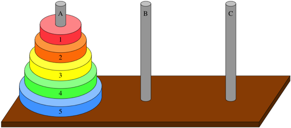

# Algoritmos e Tipos Abstratos de Dados

## Lab 8 | Exercícios + Template  

:gb: [English version](README_en.md)

Este repositório foi criado a partir de:

- <https://github.com/estsetubal-atad/CProgram_Template> 

Consulte o README se tiver dúvidas sobre a sua utilização.

----

**Objetivos**:

- Utilização do ADT Stack para desenvolvimento de um jogo.

**Referências**:

- “Tipos Abstratos de Dados – Linguagem C. Bruno Silva”, disponível no Moodle.

---

### Torres de Hanoi



O jogo das [Torres de Hanoi](https://en.wikipedia.org/wiki/Tower_of_Hanoi) é um simples *puzzle* que consiste em três torres e um determinado número de discos de vários diâmetros. **O jogo inicia-se com todos os discos empilhados, por ordem decrescente de tamanho, na primeira torre e o objetivo é mover toda a pilha de discos para a terceira torre**, obedecendo às <u>seguintes regras</u>:

- Apenas um disco pode ser movido a cada instante;

- Cada movimento consiste em mover o disco no topo de uma torre e colocá-lo numa torre vazia ou noutra torre;

- Nenhum disco pode ser colocado em cima de um disco de menor diâmetro.

O número de discos utilizados determina a *dificuldade* do jogo. 

### Nível 1 (Duração estimada: 15min)

1. Inspecione os módulos `disk` e `hanoi`; atente na definição dos tipos `Disk` e `HanoiGame` que definem como o jogo será representado;

2. Cada torre é representada por uma instância do ADT Stack. Para esse efeito, parameterize `StackElem` como sendo do tipo `Disk`;

3. Finalize a implementação da função `hanoiInit`.

    - Não conseguirá ainda testar o programa.

### Nível 2 (Duração estimada: 15min)

4. Implemente a função `hanoiSolved`, sabendo que o jogo termina quando todos os discos estiverem na 3ª torre.

    - Não se preocupe com a ordem crescente dos discos, a operação do nível 4 deverá garanti-lo.

5. Compile e teste o programa, verificando que inicialmente o estado do jogo é o pretendido, e.g., a 1ª torre contém todos os discos e as restantes estão vazias.

### Nível 3 (Duração estimada: 15min)

6. Implemente a função `hanoiCleanup` - esta deve libertar a memória das três pilhas referentes às torres.

7. Compile e teste o programa, inserindo `0` para desistir. Utilize o *valgring* para verificar a correta gestão de memória dinâmica.

### Nível 4 (Duração estimada: 30min)

8. Implemente a função `hanoiMakeMove`. O seu funcionamento deve obedecer às regras do jogo.

9. Teste o programa, verificando que consegue vencer o jogo, utilizando apenas movimentos válidos.

### Nível 5 (Duração estimada: 15min)

10. Pretende-se solicitar inicialmente (no `main`) ao utilizador a dificuldade do jogo (em tempo de execução), isto em detrimento da constante `NUMBER_DISKS` até agora utilizada (em tempo de compilação);

    - Carece de remover a constante `NUMBER_DISKS` e adicionar esse campo à estrutura `HanoiGame`, e alterar a definição da função `hanoiInit`:

    ```cpp
    typedef struct hanoiGame {
        PtStack towers[3];
        int numberDisks;
    } HanoiGame;
    ```

    ```cpp
    HanoiGame hanoiInit(int numberDisks);
    ```

    Faça as modificações necessárias para obter um programa funcional. Pode testar o jogo com 2 e 5 discos.

---

```markdown
@bruno.silva
(EOF)
``` 